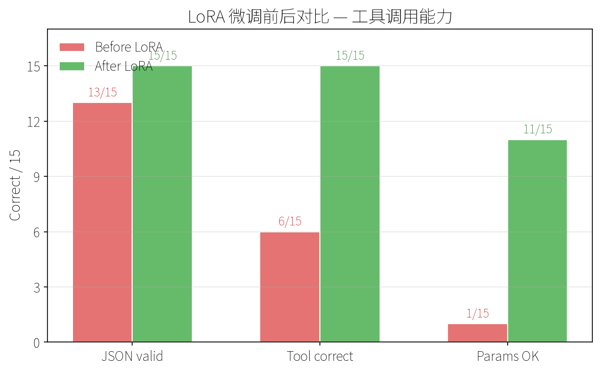
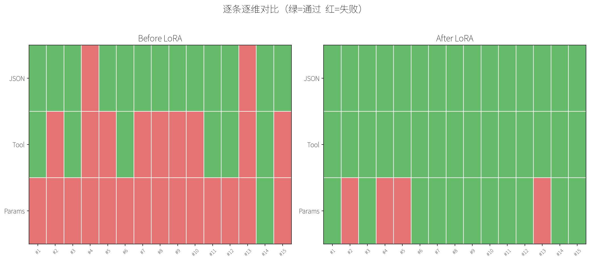
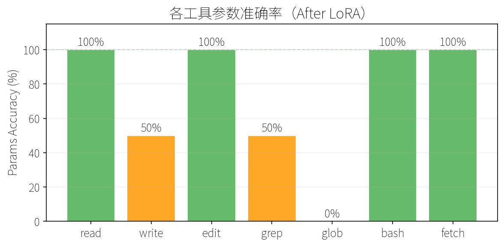

# 实验报告：LoRA 微调 Qwen2.5-0.5B 做工具调用（R1）

> 第一轮训练。CPU 环境，250 条训练数据，200 步。

---

## 一、实验设计

### 1.1 目标

用 LoRA 微调一个小模型，让它学会根据中文指令输出正确的工具调用 JSON。

### 1.2 任务定义

7 种工具，每种有固定的参数 schema：

| 工具 | 参数 | 示例指令 |
|------|------|---------|
| `read` | path | "读取 /home/project/README.md" |
| `write` | path, content | "创建 /tmp/hello.py，内容 print('hello')" |
| `edit` | path, old_string, new_string | "把 /app/config.py 的 DEBUG=False 改成 DEBUG=True" |
| `grep` | pattern, path | "搜索所有 .py 文件里的 TODO" |
| `glob` | pattern | "列出 src/ 下所有 .py 文件" |
| `bash` | cmd | "运行 pip install requests" |
| `fetch` | url | "抓取 https://api.github.com 的内容" |

### 1.3 模型与环境

| 项 | 值 |
|-----|-----|
| 基座模型 | Qwen2.5-0.5B-Instruct（954MB） |
| LoRA rank | r=16, alpha=32 |
| 目标模块 | q_proj, k_proj, v_proj, o_proj, gate_proj, up_proj, down_proj |
| 训练硬件 | CPU only（Intel 16 线程） |
| 数据类型 | float32 |

---

## 二、训练数据生成

### 2.1 生成策略

使用模板组合方式生成，而非手写。每种工具定义两个池子：

- **参数池**：路径 20 个、搜索词 12 个、URL 6 个、命令 12 条等
- **表述池**：同一种操作有 6-14 种不同中文说法

脚本 `gen_data.py` 从两个池子各取一个、随机组合，确保同样的操作有多种表述变体。

### 2.2 数据量

| 工具 | 样本数 |
|------|--------|
| read | 43 |
| write | 43 |
| edit | 43 |
| grep | 43 |
| glob | 43 |
| bash | 43 |
| fetch | 43 |
| **合计** | **301**（train 250 / eval 51） |

### 2.3 数据格式

```json
{
  "instruction": "把 /app/config.py 的 DEBUG=False 改成 DEBUG=True",
  "output": "{\"tool\":\"edit\",\"params\":{\"path\":\"/app/config.py\",\"old_string\":\"DEBUG=False\",\"new_string\":\"DEBUG=True\"}}"
}
```

训练时拼成 chat template：`<system>` + `<user>` + `<assistant>`。

---

## 三、实验过程

### 3.1 基线测试

```python
# test_baseline.py — 训练前跑 15 条测试指令，记录三维评分
```

**结果**：

```
#    Tool   JSON   ToolOK   Params   Raw
--------------------------------------------------------------------------------
1    read   Y      Y        N        {"tool":"read","params":["/home/project/README.md"
2    write  Y      N        N        {"tool":"edit","path":"/tmp/hello.py","content":"p
3    edit   Y      Y        N        {"tool":"edit","params":{"path":"/app/config.py","
4    grep   N      N        N        {"tool":"grep","params":["TODO.*\.py"],"url":"http
5    glob   Y      N        N        {"tool": "grep", "params": ["-r", "*.py", "src"]}
6    bash   Y      Y        N        {"tool": "bash", "cmd": "pip install requests"}
7    fetch  Y      N        N        {"tool":"grep","params":["github.*?content"],"url"
8    read   Y      N        N        {"tool":"grep","params":["/etc/hosts"],"cmd":"cat"
9    write  Y      N        N        {"tool": "bash", "params": ["cat /tmp/test.py | py"
10   bash   Y      N        N        {"tool":"grep","params":["/var/log","ls -la"]}
11   grep   Y      Y        N        {"tool":"grep","params":["/src/import os"],"file":
12   edit   Y      Y        N        {"tool":"edit","params":{"old_string":"/app/main.p
13   glob   N      N        N        {"tool":"grep","params":[".*\.json$"],"url":"https
14   fetch  Y      Y        Y        {"tool":"fetch","params":{"url":"http://example.co
15   read   Y      N        N        {"tool":"grep","params":["/home/user/.bashrc"],"co"

===== BEFORE LORA =====
  JSON valid:   13/15 (87%)
  Tool correct: 6/15 (40%)
  Params OK:    1/15 (7%)
```

**核心发现**：15 条中 10 条选错工具。模型学会了 JSON 外壳（87% 合法），但对"什么场景用哪个工具"完全没概念。典型模式是 **"一切皆 grep"**——把读文件、写文件、执行命令、抓网页全部当成 grep。唯一全对的是 #14（fetch 简单 URL），因为格式最简单。

### 3.2 训练

```python
# train.py — LoRA 微调，200 步，20 分钟
```

| 参数 | 值 |
|------|-----|
| 训练样本 | 250 |
| max_length | 256 |
| batch_size | 1（gradient_accumulation=4，等效 batch=4） |
| epochs | 3（max_steps=200 提前截停） |
| learning_rate | 2e-4 |
| warmup_steps | 10 |

**训练结果**：

```
train_loss:    0.3603
eval_loss:     0.168
步数:          200/200（命中 max_steps 上限）
实际 epoch:    3.176
耗时:          ~20.6 分钟
可训参数:      8,798,208 / 502,830,976（1.75%）
```

**产物**：`lora_tool_calling/adapter_model.safetensors`（33.6MB）

### 3.3 训练后评估

```python
# eval_lora.py — 同 15 条测试，同三维评分，前后对比
```

**逐条结果**：

```
===== AFTER LORA =====

#    Tool   JSON   ToolOK   Params   Raw
--------------------------------------------------------------------------------
1    read   Y      Y        Y        {"tool":"read","params":{"path":"/home/project/README.md"}}
2    write  Y      Y        N        {"tool":"write","params":{"path":"/tmp/hello.py","content":"print(\"hello\")"}}
3    edit   Y      Y        Y        {"tool":"edit","params":{"path":"/app/config.py","old_string":"DEBUG=False","new_string":"DEBUG=True"}}
4    grep   Y      Y        N        {"tool":"grep","params":{"pattern":"TODO","path":"/src"}}
5    glob   Y      Y        N        {"tool":"glob","params":{"pattern":"src/","path":"/home/user/notes"}}
6    bash   Y      Y        Y        {"tool":"bash","params":{"cmd":"pip install requests"}}
7    fetch  Y      Y        Y        {"tool":"fetch","params":{"url":"https://api.github.com"}}
8    read   Y      Y        Y        {"tool":"read","params":{"path":"/etc/hosts"}}
9    write  Y      Y        Y        {"tool":"write","params":{"path":"/tmp/test.py","content":"import sys"}}
10   bash   Y      Y        Y        {"tool":"bash","params":{"cmd":"ls -la /var/log"}}
11   grep   Y      Y        Y        {"tool":"grep","params":{"pattern":"import os","path":"/src"}}
12   edit   Y      Y        Y        {"tool":"edit","params":{"path":"/app/main.py","old_string":"port=8080","new_string":"port=3000"}}
13   glob   Y      Y        N        {"tool":"glob","params":{"pattern":"*.json","path":"/src"}}
14   fetch  Y      Y        Y        {"tool":"fetch","params":{"url":"http://example.com/api/data"}}
15   read   Y      Y        Y        {"tool":"read","params":{"path":"~/.bashrc"}}

=======================================================
Metric           Before LoRA      After LoRA       Change
-------------------------------------------------------
JSON valid       13/15 ( 87%)    15/15 (100%)    +2
Tool correct     6/15 ( 40%)    15/15 (100%)    +9
Params OK        1/15 (  7%)    11/15 ( 73%)    +10
```



---

## 四、前后对比分析



*热力图：每行 = 一条测试，每列 = 一个评分维度。绿色通过、红色失败。Before 表大片红色，After 表几乎全绿。*

### 4.1 总体提升

| 维度 | Before | After | 提升 | 解读 |
|------|--------|-------|------|------|
| JSON 合法 | 87% | **100%** | +2 | 格式完全掌握 |
| 工具正确 | 40% | **100%** | +9 | "一切皆 grep" 根治 |
| 参数全对 | 7% | **73%** | +10 | 参数 schema 大体掌握 |

### 4.2 工具选择：从随机到精准

训练前 15 条中 10 条选错工具。核心错误模式：

```
一切皆 grep
├── 读文件 → grep（#8）
├── 写文件 → bash/grep（#9）
├── 列文件 → grep（#5、#13）
├── 执行命令 → grep（#10）
├── 抓网页 → grep（#7）
└── 选 read 是 grep，选 write 还是 grep
```

训练后 **15/15 工具全部选对**，grep、glob、bash、fetch、read、write、edit 之间的边界完全清晰。250 条训练数据、200 步就解决了这个语义映射问题。

### 4.3 参数瑕疵分析

4 条参数未满分，全部集中在两类：

| # | 工具 | 问题 | 期望 | 实际 |
|---|------|------|------|------|
| 2 | write | 引号规范化 | `print('hello')` | `print("hello")` |
| 4 | grep | 路径脑补 | `"."` | `"/src"` |
| 5 | glob | pattern 截断 + 多出 path | `"src/**/*.py"` | `"src/"` + 多余 path 字段 |
| 13 | glob | pattern 截断 + 多出 path | `"**/*.json"` | `"*.json"` + 多余 path 字段 |

**根因**：

- **write #2**：语义等价（单引号→双引号），匹配算法过于严格。不算真正的错误。
- **grep #4**：指令"搜索所有 .py 文件里的 TODO"未指定路径，模型自行脑补了 `/src`。合理但不精确。
- **glob #5、#13**：真正的训练数据缺陷。glob 是唯一有两个参数错误的工具。模式是 `**/` 递归匹配写不全 + 混入 grep 才有的 `path` 参数。因为训练数据中 glob 的 pattern 变体不够多——43 条样本里缺少 `**/*.json` 这类递归 glob 的足够覆盖。

### 4.4 各工具维度得分

```
            JSON   ToolOK   Params
read    (3): YYY    YYY      YYY     ← 完美
write   (2): YY     YY       YN      ← close
edit    (2): YY     YY       YY      ← 完美
grep    (2): YY     YY       YN      ← close
glob    (2): YY     YY       NN      ← 问题集中区
bash    (2): YY     YY       YY      ← 完美
fetch   (2): YY     YY       YY      ← 完美
```



*glob = 0%，grep/write = 50%，其余完美。问题集中度一目了然。*

---

## 五、遇到的困难与解决

### 困难 1：训练导致电脑完全卡死

| 项 | 内容 |
|-----|------|
| **现象** | 运行 `train.py` 后系统失去响应，鼠标无法移动 |
| **排查** | 首先怀疑模型太大（0.5B ≈ 1GB），但内存监控显示远未打满 |
| **根因** | CPU 16 线程全部被 PyTorch 和底层 BLAS 库吃满；此外 `torch.bfloat16` 在 CPU 上无原生支持，每次运算都做类型转换，进一步加重负载 |
| **解决** | ① `torch.set_num_threads(2)` + `OMP_NUM_THREADS=2` + `MKL_NUM_THREADS=2` 限制只用 2 核；② `bfloat16 → float32`，消除不必要的类型转换；③ `max_length: 512→256`、`batch_size: 2→1`、`epochs: 5→3`、增加 `max_steps=200` 硬上限 |
| **效果** | 训练耗时 20 分钟，系统全程流畅可用 |

### 困难 2：下载模型不稳定

| 项 | 内容 |
|-----|------|
| **现象** | HuggingFace 被墙，hf-mirror 不稳定，尝试下载 SmolLM2-135M 中途断开多次 |
| **根因** | 网络环境 |
| **解决** | 换用国产平台 ModelScope 下载 Qwen2.5-0.5B-Instruct，速度稳定在 10-17MB/s |
| **启示** | 国内环境优先走 ModelScope，Qwen 系列生态最好 |

### 困难 3：Windows GBK 编码导致脚本崩溃

| 项 | 内容 |
|-----|------|
| **现象** | baseline 测试打印 `✓` `✗` 字符时抛出 `UnicodeEncodeError: 'gbk' codec can't encode` |
| **根因** | Windows 终端默认 GBK 编码，不支持这些 Unicode 字符 |
| **解决** | ① 将 `✓` `✗` 替换为 `Y` `N`；② 运行时加 `PYTHONIOENCODING=utf-8` |
| **启示** | 跨平台脚本避免使用特殊 Unicode 字符，或用 ASCII 替代 |

### 困难 4：找不到比 0.5B 更小的国产模型

| 项 | 内容 |
|-----|------|
| **现象** | 担心模型太大导致卡死，想换更小模型 |
| **排查** | 搜索 ModelScope 和全网 |
| **结论** | 国产开源 instruct 模型中，0.5B 已经是最小规格。Qwen 系列、腾讯混元系列均以此起步。唯一更小的是英文 SmolLM2-135M（135M 参数），但下载不稳定且中文能力存疑 |
| **解决** | 接受 0.5B 作为最小可用模型，通过 CPU 线程限制解决卡死问题 |

---

## 六、脚本清单

| 文件 | 用途 | 输入 | 输出 |
|------|------|------|------|
| `gen_data.py` | 生成训练数据 | 参数池 + 表述池 | `data_train.json`、`data_eval.json` |
| `test_baseline.py` | 训练前基线测试 | 基座模型 + 15 条指令 | 三维评分表 + `baseline.json` |
| `train.py` | LoRA 微调训练 | 训练数据 + 基座模型 | `lora_tool_calling/`（33.6MB 适配器） |
| `eval_lora.py` | 训练后评估对比 | 基座模型 + LoRA 适配器 + 15 条指令 | 三维评分表 + 前后对比 + `eval_detail.json` |

---

## 七、结论与下一步

### 7.1 结论

250 条合成训练数据 + 20 分钟 CPU LoRA 训练 + 33.6MB 适配器权重，将 Qwen2.5-0.5B 的工具调用能力从"几乎不可用"拉到"工具选择 100% 正确、参数 73% 全对"。

**LoRA 是个人开发者做任务微调的正确方法**——不需要 GPU，不需要改基座模型，几百条数据就能见效。

### 7.2 下一步（R2）

1. **修 glob 数据**：在 `gen_data.py` 中增加 `**/` 递归 pattern 变体和不同扩展名组合，消除 glob 的参数混淆
2. **扩充 greep 路径覆盖**：增加不指定 path 的样本，减少模型脑补
3. **重训验证**：跑第二轮，目标参数 100% 全对
4. **泛化测试**：用训练数据中未出现的路径/内容/命令组合测试模型是否真正学会了格式而非死记
